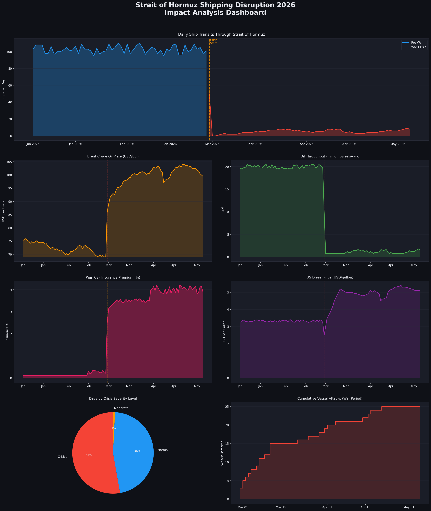
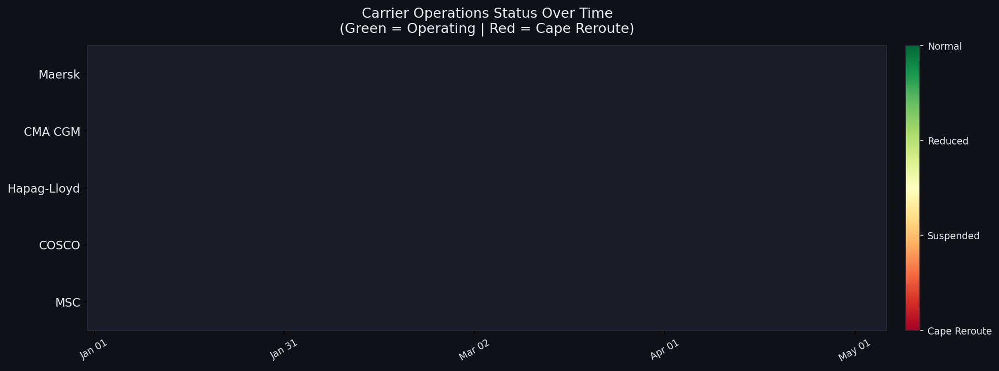

# Strait of Hormuz Shipping Disruption 2026 — Data Analytics Project

## Project Overview
Analysis of maritime shipping disruption through the Strait of Hormuz during the 2026 crisis,
covering Jan 1 – May 5, 2026 (125 days: 58 pre-war + 67 war crisis days).

## Dataset
- **Source:** Kaggle — Strait of Hormuz Shipping Disruption 2026
- **Rows:** 125 | **Columns:** 26
- **Period:** 2026-01-01 to 2026-05-05

## Tools Used
- Python (pandas, matplotlib) for cleaning & visualization
- IBM Cognos Analytics (for interactive dashboard)

## Key Findings
| Metric | Pre-War | War Crisis | Change |
|--------|---------|------------|--------|
| Daily Ship Transits | 103/day | 6/day | -94% |
| Oil Throughput | 20.0 mbpd | 1.2 mbpd | -94% |
| Brent Crude | $72.35/bbl | $99.75/bbl | +38% |
| War Risk Insurance | 0.16% | 3.75% | +23x |
| US Diesel Price | $3.33/gal | $4.87/gal | +46% |
| Vessels Attacked | 0 | 25 | — |

## Files
| File | Description |
|------|-------------|
| `strait_of_hormuz_shipping_disruption_2026__1_.csv` | Raw dataset from Kaggle |
| `hormuz_clean.csv` | Cleaned & preprocessed dataset |
| `hormuz_dashboard.png` | 7-chart analysis dashboard |
| `hormuz_carriers.png` | Carrier operations heatmap |
| `hormuz_summary_stats.csv` | Comparative statistics table |
| `hormuz_analysis_project.py` | Full analysis Python script |

## Data Cleaning Steps
1. Converted `date` column to datetime format
2. Created `period_label` for readability
3. Rounded all float columns to 2 decimal places
4. Stripped whitespace from carrier status columns
5. Added `crisis_severity` derived column
6. Zero null values in final dataset

## Visualizations
1. Daily ship transits timeline (pre-war vs crisis)
2. Brent crude oil price trend
3. Oil throughput (mbpd) timeline
4. War risk insurance premium surge
5. US diesel price impact
6. Crisis severity distribution (pie chart)
7. Cumulative vessel attacks
8. Carrier operations status heatmap (Maersk, CMA CGM, Hapag-Lloyd, COSCO, MSC)
# Hormuz Strait analysis project
## Dashboard Preview

## Carrier Analysis

